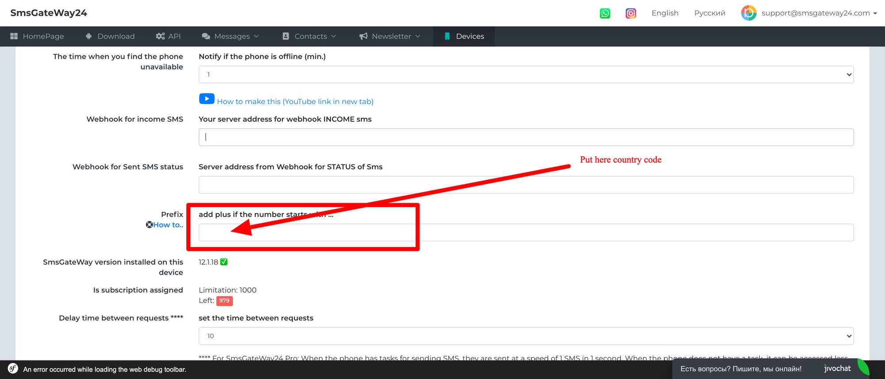

# How to add 'Plus' (+..) sign automatically in each SMS (without API)

*15.08.2021*

Added an option to create a rule to add a plus sign (+) at the beginning of a number.

For example, in your region, the country code +91 is used. But sometimes, by mistake, you can send a request to 91928... and the correct number would be +91928.... Now you can add a country code in the settings which should always be preceded by a plus sign.

How do I set this up? On the website - my devices ([https://smsgateway24.com/en/device/list](https://smsgateway24.com/en/device/list)) - choose your device . Find the "*add plus if the number starts with ...*"

Put 91 in there and press *save*.

Now when you create a text message, the system will automatically check which digit the number starts with and add a + sign if it is a 91.