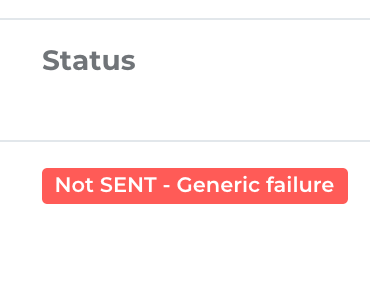
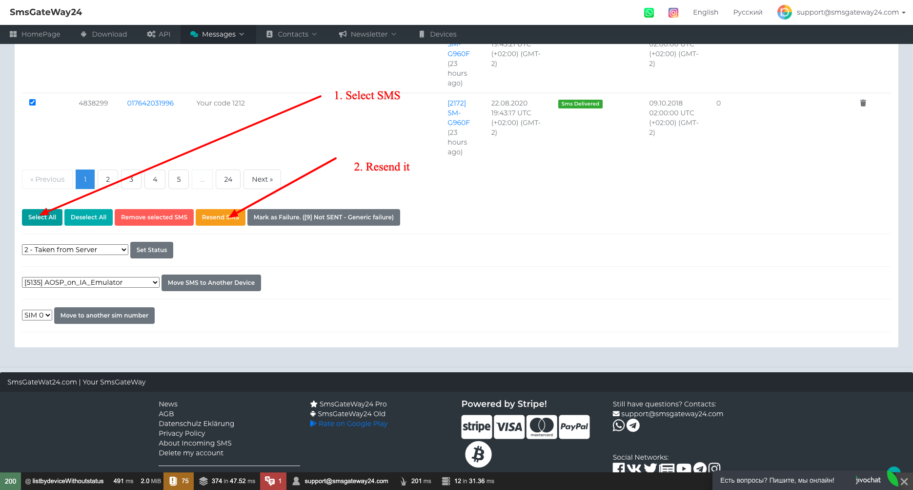
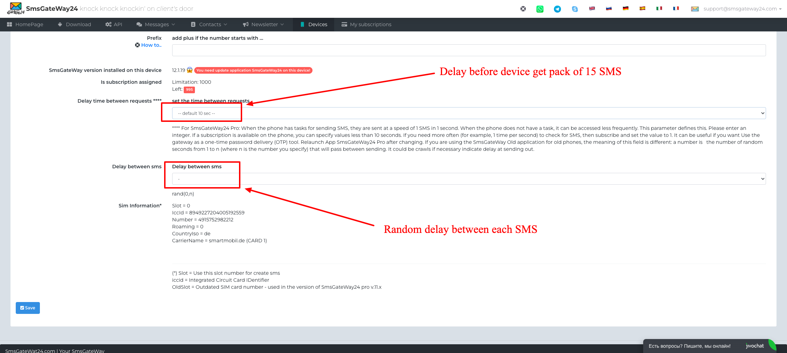

# Generic failure Issue

*The problem*

If you get an next status of SMS:
Generic failure

there is a problem with the SIM card. This usually occurs in the following situations:

- **negative balance**. You need to check your balance and if it is less than zero, you need to recharge it.
- The SIM card is **blocked**. Cured differently for everyone through the service provider. Better get a new SIM card. (SIM cards are often blocked - here's how to prevent this). How to check - try sending yourself a text message via the standard phone app and see what happens.
- SmsGateWay24 pro application glitch. Happens rarely, due to the fact that, sms can go without problems to the number in international format, such as +7928.... where +7 country code Russia, and the number 8928... also goes well. But to the number 7928... does not go. To understand why this is happening hard, because we do not recreate this error. But customers have it, then it does not. How to cure? create sms only in **international format.** That is, add a plus sign at the beginning of the number. Another solution is to set up the phone so that when you create an sms at once added a plus sign at the beginning if it is required. You can read about how to do this [Here](Default%20prefix%20for%20phone%20numbers.md)

If you have solved the Generic failure issue on your device, you can resend the sms.

### Also You can try to Add Delay for each sms. For this go to device settings and specify like this:

