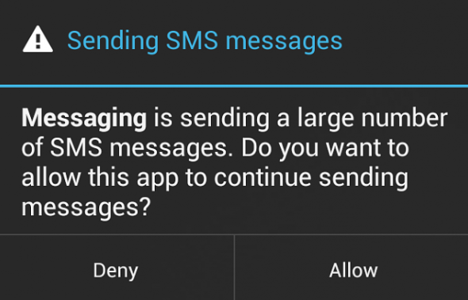

# Application is trying send a lot of SMS (Fix Error)

*Problem*

If you get an error:
## Messaging is sending a large amount of messages... Allow / Deny


Then you have to connect your device to your PC. Then Perform next steps: 

### Action plan:

1. download platform-tools from site 

[https://developer.android.com/studio/releases/platform-tools](https://developer.android.com/studio/releases/platform-tools)

2. unzip file and open directory. Open terminal (windows->CMD or terminal on Mac / Linux)
```bash
cd Downloads/platform-tools/platform-tools
adb.exe shell
settings put global sms_outgoing_check_max_count 5000
settings put global sms_outgoing_check_interval_ms 900000
reboot
exit
```
Then Try to send sms. 

*Tip:* You don't have need ROOT device. 🙂


Help Youtube Video (but on Russian)
[Youtube](https://www.youtube.com/watch?v=BXbxgm9XW9Y)
